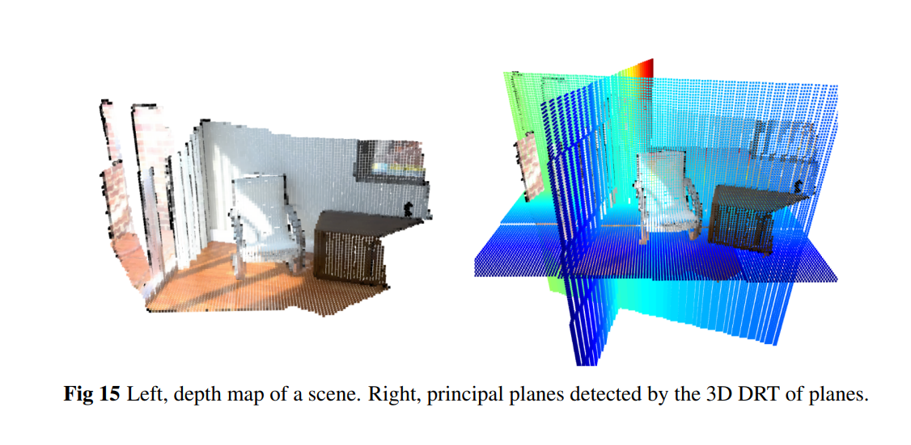

# Three-dimensional multiscale discrete Radon and John transforms

<p align="center">
    
</p>


## Authors of the paper
 * José Gil Marichal-Hernández (University of La Laguna)
 * Óscar Gómez-Cárdenes (University of La Laguna, Wooptix)
 * Fernando Rosa (University of La Laguna)
 * Jung-Young Son (Konyang University)
 * José M. Rodríguez-Ramos (University of La Laguna, Wooptix)

## Citing this work 
If using this work, please cite us:

José Gil Marichal-Hernandez, Óscar Gómez-Cárdenes, Fernando L. Rosa González, Do Hyung Kim, and José Manuel Rodríguez-Ramos "Three-dimensional multiscale discrete Radon and John transforms," Optical Engineering 59(9), 093104 (29 September 2020). https://doi.org/10.1117/1.OE.59.9.093104

## Description
This code accompanies the paper "Central and Periodic Multi-Scale Discrete Radon Transforms". 

Link to the paper: 
 * [https://doi.org/10.1117/1.OE.59.9.093104](https://doi.org/10.1117/1.OE.59.9.093104)

Link to the pre-print:
 * [https://doi.org/10.48550/arXiv.2501.13664](https://doi.org/10.48550/arXiv.2501.13664)

This project allows to test and benchmark the 2 algorithms analyzed in this paper which are versions of the Multiscale Discrete Radon Transform (DRT):
 * 3D DJT
 * 3D DRT

It also supports the following targets:
 * x86-64  (host)
 * Android arm64 (standalone linux binary)

## Structure of the project

```
.
├── common                                 C++ Halide implementations of the algorithms.
├── platforms                              Specific code for different platforms. It depends on common.
│   ├── arm-standalone 
│   └── linux
├── make_benchmarks.sh                     Script to run benchmarks for all algorithms and all sizes
├── Makefile                               Build and run tool
└── README.md                              This file
```

## Installation
Two dependencies are needed in order to run this project:
1. Halide
2. Android Sdk, ndk and toolchain

### Halide Installation

Download with `Halide 10.0.1` from the [releases](https://github.com/halide/Halide/releases/tag/v10.0.1) page. Then extract it in a direcory of your choice and define the variable `HALIDE_ROOT` pointing to the root of the repo. You can use the following script. Adjust the correct version for your architecture if needed.

```shell
wget https://github.com/halide/Halide/releases/download/v10.0.1/Halide-10.0.1-x86-64-linux-efb326253c73a555d7a4608e41228665d1785e97.tar.gz
tar xvf Halide-10.0.1-x86-64-linux-efb326253c73a555d7a4608e41228665d1785e97.tar.gz
export HALIDE_ROOT=$(pwd)/Halide-10.0.1-x86-64-linux
```

# Compiling and Running

In order to compile and run, the SCHED and ARCH have to be specified like so:

```shell
make SCHED=auto_sched ARCH=arm-64-android
make SCHED=manual_sched ARCH=host
```

Or use directly the targets made for that, which define them for you.
```
make arm64-run-nosched N=32
make host-nosched N=32
make arm64-run-nosched N=32
make host-nosched N=32
```

### Android Standalone 
You have to generate a standalone toolchain first to be able to
 cross-compile to ARM. This operation has to be done only once:

```shell
mkdir ndk && cd ndk
wget https://dl.google.com/android/repository/android-ndk-r26d-linux.zip
unzip android-ndk-r26d-linux.zip
cd android-ndk-r26d
build/tools/make_standalone_toolchain.py \
 --arch arm64 --stl libc++ --api 21 --install-dir /opt/arm64-standalone-toolchain
```
